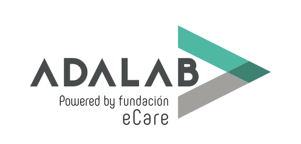

# Evaluación final Sprint 1
En este repo encontrarás mi propuesta al mockup de de la evaluación final del primer sprint.

## Criterios de maquetación
Para maquetar la web de forma responsive, he tenido en cuenta los siguientes puntos:
1. Header adapatado al 100% de la altura del viewport
2. Menú fijo
3. Para la estructura HTML, sintaxis, semántica e indentación revisadas

## CSS / SCSS
El diseño CSS está escrito siguiendo el lenguaje de preprocesado SASS/SCSS.
1. Uso de variables para colores y fuentes
2. Mixins para botones e iconos
3. Flexbox y posicionamiento 
4. CSS Grid para la sección "3 Reasons to Purchase"
5. Media queries 

## Interacciones
Para dar dinamismo a la página, he introducido las siguientes transiciones:
- El botón de scroll-down del hero enlaza a la sección siguiente.
- El botón de scroll-up del footer enlaza con el hero.
- Los botones call-to-action de las secciones tienen un efecto "botón" con sombreado y que se activa al posar el cursor sobre ellos.
- Los botones de scroll tienen una pequeña animación.

## Automatización
Este repo utiliza un kit de Gulp que puedes ver [aquí](https://github.com/Adalab/Adalab-web-starter-kit). 
Lanza un webserver con BrowserSync y varios watchers estarán pendientes de los archivos SCSS/JS/HTML, en la carpeta **public/**, para recargar el navegador cuando se necesite.

## Mejoras bienvenidas
Si encuentras una forma alternativa y más sencilla para resolver el diseño, hazme un PR :-)

Y ya, para terminar:

